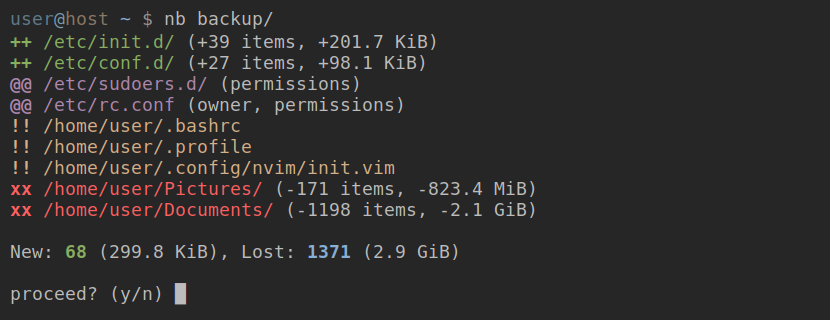

[](https://github.com/AlxHnr/nano-backup/actions/workflows/ci.yml)
[](https://codecov.io/github/AlxHnr/nano-backup?branch=master)
[](https://github.com/AlxHnr/nano-backup/blob/master/LICENSE)


The first thing nano-backup shows you when you do a backup, is _what has
changed_ since the last backup. This allows you to review all the files you
have tinkered with before _committing them_ to your repository. The goal
here is to enable a fast review, restore and commit cycle, giving you
precise control about the state of your system.

Nano-backup focuses only on local backups. It does not support cloud
providers, encryption, compression or granular chunk/delta based
deduplication. It only implements whole-file deduplication. Encryption can
be achieved by backing up to a LUKS partition.

## Installation

Nano-backup depends only on a C compiler and GNU Make.  Download and unpack
the latest stable release and run the following command from inside the
extracted directory:

```sh
CFLAGS="-O2" LDFLAGS="-O2" make -j"$(nproc)"
sudo cp ./build/nb /usr/local/bin/
```

## Usage

A repository is a directory with a file named `config` inside it:

```sh
mkdir repo/
vi repo/config
```

Here is an example config:

```ini
[mirror]
/home/user/Videos
/home/user/Pictures
```

The first line sets the mirror [policy](#policies). The other lines are
absolute paths to files or directories which should be backed up. To do a
backup, pass the repository to nano-backup:

```sh
nb repo/
```

To prevent files from being backed up, set the ignore policy. This allows
specifying regular expressions, which will be matched against full,
absolute filepaths. They must be valid POSIX extended regular expressions:

```ini
[ignore]
\.pyc$
^/home/user/.*/__pycache__$
```

Regular expressions can also be used for matching files you want to backup.
Just prefix a pattern with an additional slash:

```ini
[mirror]
/home/user//\.(png|jpg)$
/home//^(foo|bar)$/.bashrc
```

**Note**: These expressions will not match recursively and can be
terminated by a slash.

### Restoring files

Files can be restored like this:

```sh
nb repo/ 0 file.txt
```

_0_ is the id of the latest backup. The backup before it would be _1_, etc.

**Note**: This number will be ignored for copied/mirrored files, which will
always be restored to their latest state.

## Policies

Policies specify how files should be backed up. They apply only to the last
element of a path, but will match all files inside it recursively:

```ini
[policy]
/home/user/last-element
```

Policy name | Description
------------|-------------
copy        | Backup only the latest version of a file.
mirror      | Like copy, but if a file gets removed from the system, it will also be removed from the backup.
track       | Keep a full history of every change.
ignore      | Allows specifying regular expressions for excluding paths.
summarize   | Allows specifying regular expressions for directories which should not be listed recursively during backups.

## Frequently asked questions

### How do I synchronize two repositories?

```sh
cp -rn current/* old/
cp current/{config,metadata} old/
nb old/ gc
```

### Can I run a hook before/after each backup?

No, write a wrapper script instead:

```sh
#/bin/sh -e

... # Run stuff before the backup.

nb "$HOME/backup"

... # Run stuff after the backup.
```

### Can I tell it to do automatic backups once a day?

No, this is the task of tools like cron.
